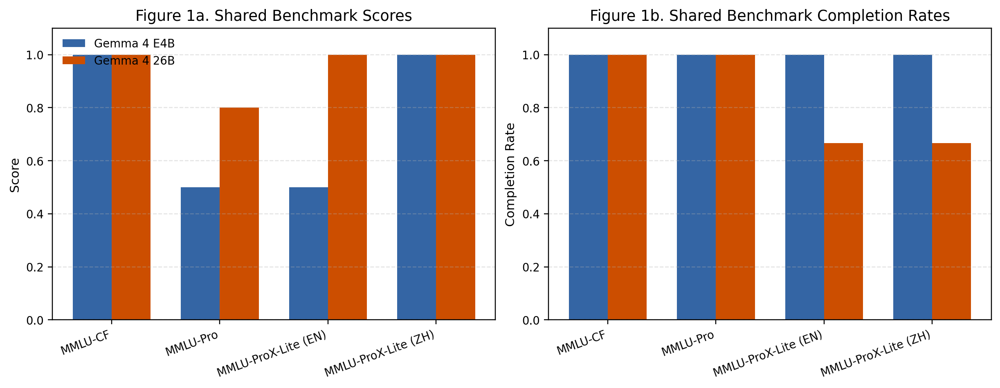
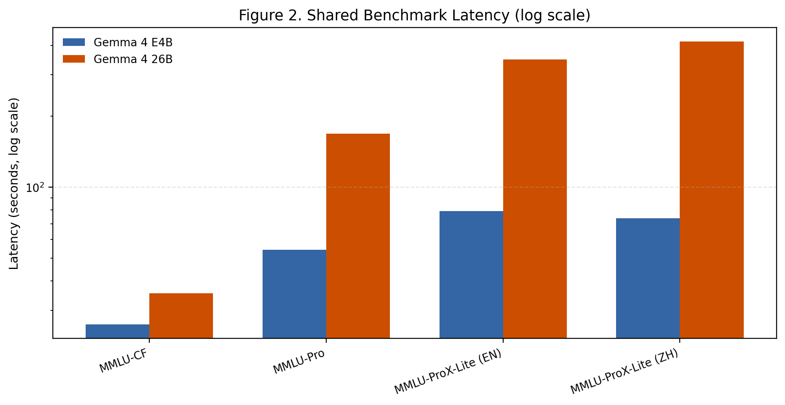
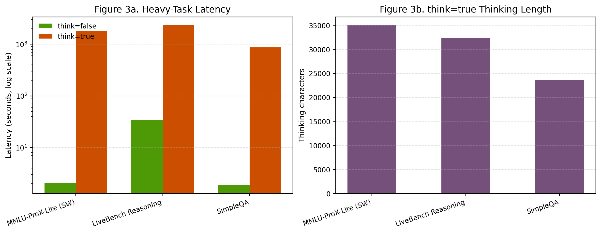

# Gemma 4 Frontier Evaluation in Local Deployment

## Abstract

Large language model evaluation has shifted from static, saturated benchmarks toward harder, contamination-aware, multilingual, and dynamically updated evaluation suites. To study how this shift affects small-scale local deployment research, this paper evaluates two locally runnable models from the same family, `gemma4:e4b` and `gemma4:26b`, under a unified local inference setting. Our benchmark suite combines `MMLU-Pro`, `MMLU-CF`, `MMLU-ProX-Lite`, `LiveBench Reasoning`, and `SimpleQA`, and supplements them with latency, completion rate, and intermediate thinking statistics. The results show a clear tradeoff. On contamination-controlled and high-difficulty knowledge reasoning benchmarks, `gemma4:26b` is stronger than `gemma4:e4b`; for example, on the current official shared benchmark subset, `26B` reaches `0.8000` on `MMLU-Pro` while `E4B` reaches `0.5000`, and both reach `1.0000` on `MMLU-CF`. However, the larger model incurs much higher latency and lower completion stability on multilingual advanced reasoning tasks. In the official `MMLU-ProX-Lite` subset, `26B` achieves higher or equal scored accuracy than `E4B`, but its completion rate drops to `66.7%` on both English and Chinese subsets due to repeated long-thinking failures. A heavy-task case study further shows that `think=true` can produce thousands to tens of thousands of reasoning characters without improving task completion, indicating that inference-time reasoning traces should be analyzed separately from final task success. These findings suggest that, in local deployment settings, larger reasoning-enabled models are not simply “better but slower”; they are benchmark-sensitive systems with uneven gains across contamination-controlled reasoning, multilingual reasoning, and factuality tasks.

## Introduction

The rapid progress of large language models has made evaluation itself a moving target. Earlier benchmarks such as MMLU were designed to measure broad world knowledge and multitask understanding, but their usefulness has weakened as frontier models improved and static test sets became increasingly vulnerable to contamination and saturation [1]. More recent work therefore emphasizes three changes. First, harder reasoning-oriented benchmarks such as `MMLU-Pro` increase discriminative power by removing trivial items and expanding the answer space [2]. Second, contamination-aware suites such as `MMLU-CF` and dynamically updated benchmarks such as `LiveBench` aim to reduce the risk that public test questions are memorized by later models [3][4]. Third, multilingual and long-context evaluation are becoming central, with datasets such as `MMLU-ProX` and `LongBench v2` designed to measure whether advanced reasoning remains stable across languages and long realistic contexts [5][6]. At the same time, factuality-specific evaluation has returned to the foreground through benchmarks such as `SimpleQA`, which target short, verifiable answers and lower-variance measurement [7].

These developments create a concrete problem for course-level empirical work. A small local study can no longer rely on a handful of classic tasks if it wants to make claims about current model behavior. Yet the newest benchmark suites are often expensive to run, especially when models expose long intermediate reasoning traces. This paper addresses that gap by reframing a local model-comparison assignment around a frontier-style benchmark suite while retaining reproducibility on a single workstation. Instead of comparing unrelated models, we compare two sizes from the same newly released open model family, `Gemma 4`, which Google announced on April 2, 2026 as an Apache 2.0 licensed family aimed at on-device and edge deployment, with multi-step planning and support for more than 140 languages [8].

The central question is whether a larger local model from the same family provides stable gains on modern frontier benchmarks once both accuracy and runtime behavior are considered. We focus on `gemma4:e4b` and `gemma4:26b`, which differ substantially in parameter count and context capacity while remaining runnable in the same lab environment. Our results suggest a nuanced answer: the larger model improves high-difficulty and contamination-controlled reasoning, but its gains do not consistently transfer to multilingual advanced reasoning under strict local constraints, and its thinking traces often become the dominant source of latency.

This paper makes three practical contributions. First, it adapts a course-level local evaluation project to a frontier-style benchmark regime rather than a legacy static-benchmark regime. Second, it introduces a reproducible local pipeline that records both final answers and streamed intermediate reasoning. Third, it shows empirically that local open-model comparison changes qualitatively once completion rate and long-thinking failures are treated as first-class metrics instead of hidden execution artifacts.

## Related Work

### From classic multitask benchmarks to harder reasoning-oriented evaluation

`MMLU` established a broad multitask evaluation framework spanning 57 tasks and made knowledge-and-reasoning comparisons across models straightforward [1]. However, as benchmark saturation increased, it became less sensitive to newer capability differences. `MMLU-Pro` was proposed specifically to address this issue by introducing more reasoning-focused items, expanding each question from four choices to ten, and removing trivial or noisy items. The benchmark reports a `16%` to `33%` accuracy drop relative to MMLU and reduced prompt sensitivity, making it more discriminative for advanced models [2]. Our work follows this shift by treating `MMLU-Pro` rather than classic `MMLU` as the main high-difficulty knowledge benchmark.

### Contamination-aware and dynamically refreshed evaluation

One of the strongest criticisms of open LLM evaluation is benchmark contamination. `MMLU-CF` directly targets this problem by constructing a contamination-free benchmark with decontamination rules and a closed-source test split, explicitly separating validation transparency from test reliability [3]. `LiveBench` extends the same line of thought in a different direction: instead of relying on a fixed benchmark, it uses frequently updated questions sourced from recent math competitions, recent papers, news, and datasets, and emphasizes automatic objective scoring over LLM-judge or crowd-based evaluation [4]. These benchmarks are especially relevant to our setup because a local open model can appear strong on saturated tasks while still failing on contamination-resistant or rapidly changing ones.

### Multilingual reasoning benchmarks

Earlier multilingual reasoning work such as MGSM showed that chain-of-thought prompting can emerge across languages and that even underrepresented languages may benefit from larger-scale models [9]. XCOPA similarly established multilingual causal commonsense reasoning as a distinct evaluation axis and showed that cross-lingual transfer remains difficult, especially for low-resource languages [10]. More recent multilingual frontier evaluation moves beyond translated school-level or causal-reasoning tasks toward advanced parallel reasoning suites. `MMLU-ProX` addresses this by building on `MMLU-Pro` and extending it to 29 languages, with identical question sets across languages and a lite subset for more efficient evaluation. Its experiments report sizable performance gaps between high-resource and low-resource languages, with declines of up to `24.3%` [5]. Our choice of `MMLU-ProX-Lite` is motivated directly by this finding: multilingual performance should not be inferred from English-only reasoning benchmarks.

### Long-context and factuality evaluation

Long-context evaluation has also evolved. The original `LongBench` benchmark measured bilingual long-context understanding across multiple task types [11], while `LongBench v2` raises difficulty substantially by focusing on realistic long-context multitasks with contexts ranging from `8k` to `2M` words, and by showing that stronger inference-time reasoning can outperform direct answering and even exceed the reported human baseline on the benchmark [6]. In our project, `LongBench v2` is kept as an extension rather than part of the default suite because of compute limits, but it informs our interpretation of long reasoning traces as a potentially meaningful, not merely wasteful, phenomenon.

For factuality, `SimpleQA` argues that short, fact-seeking questions make evaluation more tractable and lower variance while remaining challenging for frontier models; OpenAI reports that even GPT-4o scores below `40%` on the benchmark [7]. This makes `SimpleQA` especially useful as a complement to reasoning-heavy multiple-choice evaluation. A model can appear competent on structured reasoning tasks yet still fail badly on short factual recall.

### Positioning of this paper

Compared with the papers above, this work does not propose a new benchmark. Its contribution is methodological and empirical at a smaller scale: it shows how a course-style local study can be redesigned to align with current frontier evaluation practice. The key design move is to combine harder, contamination-aware, multilingual, and factuality-focused benchmarks inside a unified local runner, then analyze not only score but also completion rate, latency, and thinking-trace behavior.

## Method

### Model selection

We compare two models from the same family:

- `gemma4:e4b`
- `gemma4:26b`

This controls for architecture family while allowing a meaningful comparison of scale, context length, and runtime behavior. According to the local model inventory and project configuration, `gemma4:e4b` is an `8.0B` model with a `131072` token context window, while `gemma4:26b` is a `25.8B` model with a `262144` token context window. The larger `31B` variant is excluded from the default experiments because it is not comfortable to run on the current workstation.

### Benchmark suite

The core suite combines five frontier-oriented benchmarks:

1. `MMLU-Pro` for harder knowledge and reasoning evaluation [2]
2. `MMLU-CF` for contamination-aware reasoning evaluation [3]
3. `MMLU-ProX-Lite` for multilingual advanced reasoning evaluation [5]
4. `LiveBench Reasoning` for dynamically refreshed, automatically scored reasoning evaluation [4]
5. `SimpleQA` for short factual question answering [7]

`LongBench v2` is retained as an optional extension because it is directly relevant to long-context frontier evaluation [6], but it is not part of the default full run due to compute cost.

### Task construction and scoring

Each benchmark sample is converted to a unified JSONL task schema with fields such as `benchmark`, `group`, `language`, `prompt`, `reference`, `metric`, and `response_parser`. Multiple-choice tasks (`MMLU-Pro`, `MMLU-CF`, `MMLU-ProX-Lite`) are scored by extracting the first valid answer letter and comparing it to the reference answer. `LiveBench Reasoning` is scored by extracting the `<solution>...</solution>` content and matching it to the normalized reference. `SimpleQA` is scored locally through an approximate matching rule rather than the official classifier-based grading pipeline, so its scores are treated as indicative rather than final publication-grade results.

### Inference settings

The formal runs in this project use a unified setting:

- `temperature = 0.2`
- `top_p = 0.9`
- `think = true`
- requested `num_ctx = 262144`

The runner streams outputs from Ollama and records both intermediate reasoning and final answers. For each task, we log:

- `latency_sec`
- `first_thinking_sec`
- `first_response_sec`
- `thinking_chars`
- `response_chars`
- `status`
- `score`

This logging design reflects the fact that, for reasoning-enabled open models, intermediate thinking is itself part of the observed runtime behavior. During later experiments, we added bounded long-thinking controls so that extremely long tasks could be recorded as `long_think` instead of silently stalling the whole batch.

### Experimental stages

The project uses a staged evaluation design:

1. `frontier_pilot_e4b` to establish the baseline behavior of the smaller model
2. `frontier_calibration_26b` to confirm that the larger model can complete a representative subset under formal settings
3. `frontier_pilot_26b_safe` to extend `26B` to a safer subset of official tasks
4. `frontier_heavy_26b` to stress-test difficult multilingual, dynamic, and factuality tasks

This staging is important because frontier-style benchmarks are not equally runnable under local hardware constraints. The methodology therefore combines benchmark design with execution-risk management.

## Experiment

### Experimental environment and evidence base

All experiments are run locally through the project’s benchmark runner, with outputs written to structured `metadata.json`, `raw_outputs.jsonl`, `summary.csv`, and thinking-trace Markdown files. The main evidence used in this draft comes from:

- `outputs/frontier_pilot_e4b_thinktrue_ctx256k_20260408/`
- `outputs/frontier_calibration_26b_thinktrue_ctx256k_20260408/`
- `outputs/frontier_pilot_26b_safe_thinktrue_ctx256k_20260409/`
- `outputs/frontier_heavy_26b_thinktrue_ctx256k_20260408/`
- `outputs/frontier_analysis_official_extended_20260409/`
- `outputs/frontier_analysis_heavy_compare_20260409/`

### Official shared benchmark results

Table 1 summarizes the benchmarks that both `E4B` and `26B` completed under the project’s official `think=true` configuration.

| Benchmark | E4B 得分 | E4B 完成率 | E4B 平均时延(s) | 26B 得分 | 26B 完成率 | 26B 平均时延(s) |
| --- | --- | --- | --- | --- | --- | --- |
| MMLU-CF | 1.0000 | 100.0% | 26.16 | 1.0000 | 100.0% | 35.48 |
| MMLU-Pro | 0.5000 | 100.0% | 54.20 | 0.8000 | 100.0% | 168.93 |
| MMLU-ProX-Lite (EN) | 0.5000 | 100.0% | 79.02 | 1.0000 | 66.7% | 347.87 |
| MMLU-ProX-Lite (ZH) | 1.0000 | 100.0% | 73.91 | 1.0000 | 66.7% | 415.19 |

These values come from the current report packet generated from the experiment outputs.

### Heavy-task case study

Because the heaviest tasks expose the strongest differences between raw capability and practical usability, we also include a case-study comparison of `26B` under `think=false` and `think=true`.

| Task ID | Benchmark | think=false 状态 | think=false 时延(s) | think=true 状态 | think=true 时延(s) | think=true thinking 字符 |
| --- | --- | --- | --- | --- | --- | --- |
| `mmlu_prox_lite_sw-70` | MMLU-ProX-Lite (SW) | ok | 2.06 | ok | 1813.74 | 35003 |
| `livebench_reasoning-bd14ba82d1fe813d` | LiveBench Reasoning | ok | 34.65 | long_think | 2371.41 | 32279 |
| `simpleqa-0` | SimpleQA | ok | 1.85 | long_think | 867.49 | 23660 |

This table is not meant to replace the official benchmark summary; rather, it shows how the same model can switch from useful reasoning to unusable reasoning depending on task type.

## Results

### Larger scale helps on contamination-controlled and harder reasoning benchmarks

The most stable gain for `gemma4:26b` appears on contamination-controlled and high-difficulty multiple-choice reasoning. On the official extended benchmark subset, `26B` reaches `1.0000` on `MMLU-CF` across eight completed samples and `0.8000` on `MMLU-Pro` across five completed samples. In contrast, `E4B` reaches `1.0000` on `MMLU-CF` but only `0.5000` on `MMLU-Pro`. This pattern supports the hypothesis that increased scale provides meaningful benefits on harder knowledge-and-reasoning tasks, not merely on easier saturated benchmarks.

### Completion rate becomes a critical metric on multilingual advanced reasoning

If we looked only at scored samples, `26B` would appear strictly better on `MMLU-ProX-Lite (EN)` and at least as good on `MMLU-ProX-Lite (ZH)`. But that interpretation would be misleading. The larger model completes only `66.7%` of the official English and Chinese `MMLU-ProX-Lite` tasks, while `E4B` completes `100%`. In other words, the larger model is better on the tasks it finishes, but it is less reliable as a local multilingual evaluation system. This is precisely why completion rate must be reported alongside accuracy in local frontier evaluation.

### Thinking traces explain much of the latency gap

The latency difference between the two models is not simply due to larger parameters; it is closely connected to prolonged thinking phases. On the official shared benchmark subset, `26B`’s average latency is about `3.1x` that of `E4B` on `MMLU-Pro`, `4.4x` on `MMLU-ProX-Lite (EN)`, and `5.6x` on `MMLU-ProX-Lite (ZH)`. The recorded thinking traces show why: `26B` regularly produces thousands of intermediate reasoning characters and often delays its first response until very late in the run.

This pattern is even clearer in the heavy-task case study. For `mmlu_prox_lite_sw-70`, `think=true` preserves correctness but expands runtime from `2.06s` to `1813.74s`. For `LiveBench Reasoning` and `SimpleQA`, `think=true` produces very long traces but fails to reach a final answer before the task is marked as `long_think`. Therefore, thinking length should be treated as an independent experimental signal rather than assumed to be a proxy for quality.

### The larger model is not uniformly “better but slower”

A simplistic reading would be that `26B` is stronger and merely pays a speed penalty. The data do not support such a uniform claim. Instead, the results suggest three distinct regimes:

1. On contamination-controlled reasoning (`MMLU-CF`), `26B` is strong and reasonably stable.
2. On high-difficulty knowledge reasoning (`MMLU-Pro`), `26B` is stronger but much slower.
3. On multilingual advanced reasoning and the heaviest tasks, `26B` becomes unstable under `think=true`, and completion failures become a major practical issue.

This is the most important empirical takeaway of the study: local frontier evaluation must distinguish between capability, efficiency, and completion stability.

From the perspective of a course paper, Figures 1-3 make this distinction visible at a glance. Figure 1 shows that benchmark-level score comparisons alone would favor the larger model on several tasks. Figure 2 shows that these gains come with rapidly increasing latency. Figure 3 then demonstrates that, on the heaviest tasks, the observed latency is not just “slow decoding” but often a symptom of prolonged thinking without timely final response generation.

## Conclusion

This paper revisited a course-style model comparison problem under a frontier-evaluation perspective. By combining `MMLU-Pro`, `MMLU-CF`, `MMLU-ProX-Lite`, `LiveBench Reasoning`, and `SimpleQA`, and by logging not only accuracy but also completion rate, latency, and thinking traces, we obtained a more realistic picture of local open-model behavior.

The main conclusion is that `gemma4:26b` is advantageous on hard and contamination-aware reasoning benchmarks, but it is not consistently superior in a practical local setting. Its gains come with large latency costs and, more importantly, with benchmark-dependent instability on multilingual advanced reasoning and heavy tasks. In contrast, `gemma4:e4b` is weaker on the hardest knowledge benchmark but more operationally stable.

For a course paper, these findings support a broader methodological claim: modern LLM evaluation should no longer be framed as a single leaderboard-style comparison. Even at small scale, it should combine contamination awareness, multilingual reasoning, factuality, and runtime observability. Future work can extend this project in three directions: first, by adding more controlled `LongBench v2` runs; second, by replacing the local approximate `SimpleQA` grader with the official classifier-based pipeline; and third, by converting the current report packet into publication-quality figures and a cleaner statistical analysis.

## References

[1] Hendrycks, D., Burns, C., Basart, S., Zou, A., Mazeika, M., Song, D., and Steinhardt, J. “Measuring Massive Multitask Language Understanding.” arXiv:2009.03300, submitted September 7, 2020, revised January 12, 2021. <https://arxiv.org/abs/2009.03300>

[2] Wang, Y., Ma, X., Zhang, G., Ni, Y., Chandra, A., Guo, S., Ren, W., Arulraj, A., He, X., Jiang, Z., Li, T., Ku, M., Wang, K., Zhuang, A., Fan, R., Yue, X., and Chen, W. “MMLU-Pro: A More Robust and Challenging Multi-Task Language Understanding Benchmark.” arXiv:2406.01574, submitted June 3, 2024, revised November 6, 2024. <https://arxiv.org/abs/2406.01574>

[3] Zhao, Q., Huang, Y., Lv, T., Cui, L., Sun, Q., Mao, S., Zhang, X., Xin, Y., Yin, Q., Li, S., and Wei, F. “MMLU-CF: A Contamination-free Multi-task Language Understanding Benchmark.” arXiv:2412.15194, submitted December 19, 2024. <https://arxiv.org/abs/2412.15194>

[4] White, C., Dooley, S., Roberts, M., Pal, A., Feuer, B., Jain, S., Shwartz-Ziv, R., Jain, N., Saifullah, K., Dey, S., Shubh-Agrawal, Sandha, S. S., Naidu, S., Hegde, C., LeCun, Y., Goldstein, T., Neiswanger, W., and Goldblum, M. “LiveBench: A Challenging, Contamination-Limited LLM Benchmark.” arXiv:2406.19314, submitted June 27, 2024, revised April 18, 2025. <https://arxiv.org/abs/2406.19314>

[5] Xuan, W., Yang, R., Qi, H., Zeng, Q., Xiao, Y., Feng, A., Liu, D., Xing, Y., Wang, J., Gao, F., Lu, J., Jiang, Y., Li, H., Li, X., Yu, K., Dong, R., Gu, S., Li, Y., Xie, X., Juefei-Xu, F., Khomh, F., Yoshie, O., Chen, Q., Teodoro, D., Liu, N., Goebel, R., Ma, L., Marrese-Taylor, E., Lu, S., Iwasawa, Y., Matsuo, Y., and Li, I. “MMLU-ProX: A Multilingual Benchmark for Advanced Large Language Model Evaluation.” arXiv:2503.10497, submitted March 13, 2025, revised May 26, 2025. <https://arxiv.org/abs/2503.10497>

[6] Bai, Y., Tu, S., Zhang, J., Peng, H., Wang, X., Lv, X., Cao, S., Xu, J., Hou, L., Dong, Y., Tang, J., and Li, J. “LongBench v2: Towards Deeper Understanding and Reasoning on Realistic Long-context Multitasks.” arXiv:2412.15204, submitted December 19, 2024, revised January 3, 2025. <https://arxiv.org/abs/2412.15204>

[7] OpenAI. “Introducing SimpleQA.” October 30, 2024. <https://openai.com/index/introducing-simpleqa/>

[8] Google AI Edge Team. “Bring state-of-the-art agentic skills to the edge with Gemma 4.” Google Developers Blog, April 2, 2026. <https://developers.googleblog.com/bring-state-of-the-art-agentic-skills-to-the-edge-with-gemma-4/>

[9] Shi, F., Suzgun, M., Freitag, M., Wang, X., Srivats, S., Vosoughi, S., Chung, H. W., Tay, Y., Ruder, S., Zhou, D., Das, D., and Wei, J. “Language Models are Multilingual Chain-of-Thought Reasoners.” arXiv:2210.03057, submitted October 6, 2022. <https://arxiv.org/abs/2210.03057>

[10] Ponti, E. M., Glavaš, G., Majewska, O., Liu, Q., Vulić, I., and Korhonen, A. “XCOPA: A Multilingual Dataset for Causal Commonsense Reasoning.” Proceedings of EMNLP 2020. <https://aclanthology.org/2020.emnlp-main.185/>

[11] Bai, Y., Lv, X., Zhang, J., Lyu, H., Tang, J., Huang, Z., Du, Z., Liu, X., Zeng, A., Hou, L., Dong, Y., Tang, J., and Li, J. “LongBench: A Bilingual, Multitask Benchmark for Long Context Understanding.” arXiv:2308.14508, submitted August 28, 2023. <https://arxiv.org/abs/2308.14508>
